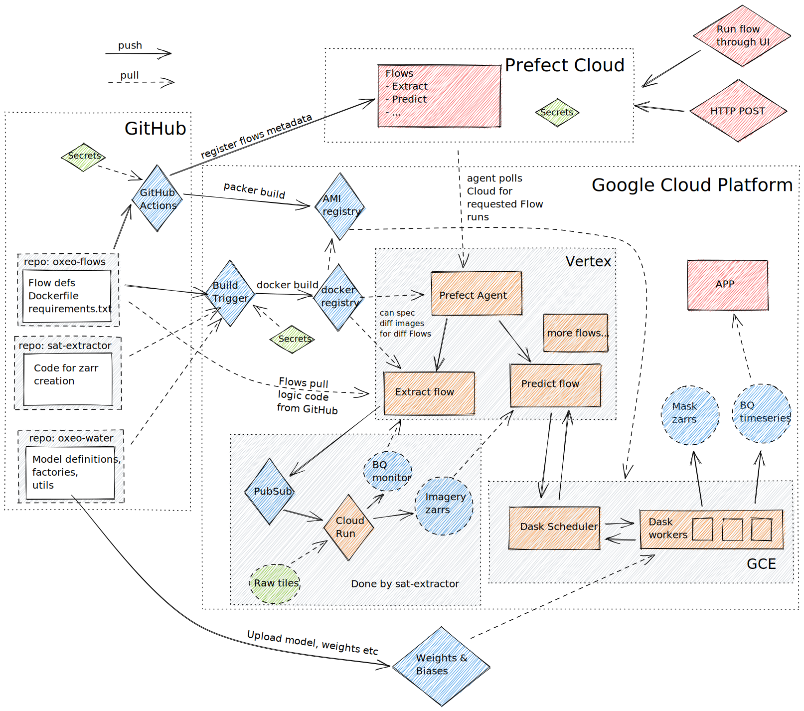

# oxeo-flows
[](https://github.com/oxfordeo/oxeo-flows/actions/workflows/prefect-register.yml)
[](https://github.com/oxfordeo/oxeo-flows/actions/workflows/build-deploy.yml)

Repository for managing pipelines etc, using Prefect for orchestration.



## Getting started
**TODO**: Currently any internal dependencies (such as the `oxeo/flows/utils.py` file) can *not* be pulled from GitHub, and therefore must be installed into the Docker image.
Have set the GitHub Action to watch `utils.py` only. Not sure what the best method is...

### Project structure
Currently quite basic. At some point we'll probably want to separate actual business logic, from task definitions, from Flow definitions.
Something like what is described [here](https://github.com/PrefectHQ/prefect/issues/1300).

```
.
├── cloudbuild.yaml      # insert secrets into Cloud Build
├── setup.cfg            # Requirements and things in here
├── Dockerfile
├── oxeo
│   └── flows            # Flow logic in here!
│       ├── extract.py
│       ├── __init__.py  # Constants, image names etc here
│       ├── predict.py
│       ├── template.py  # TEMPLATE FLOW FILE HAVE A LOOK!
│       └── utils.py
├── packer               # Packer creates the Dask OS image
│   └── ...
├── docs                 # useful docs and commands
│   └── ...
├── helm-chart-dask.yaml # Dask Helm chart config (not using)
└── ...
```

### Installation
Install the dependencies and the library in a virtualenv:
```
pip install -e .[dev]
pre-commit install
```

### Prefect Cloud
Log in at [Prefect Cloud](https://cloud.prefect.io/) and get an API key from the user account page (different from an agent/project key).

Tell core that we're working with Cloud and authenticate:
```
prefect backend cloud
prefect auth login --key <your-api-key>
```
(If you get authentication errors, you may need to delete `~/.prefect/`.)

## Adding a flow
1. Make a copy of the [template](./oxeo/flows/template.py) as a starting point.
2. Have a look through the comments there!
3. Write some tasks and link them up into a flow!
4. Add any new dependencies to requirements.txt

### Run a flow locally
This works even if the Flow is set up with `VertexRun` etc
(i.e. the `storage` and `run_config` arguments you passed to your `Flow` will be ignored).

Probably best to try with the plain `DaskExecutor` to start off with.
```
prefect run -p oxeo/flows/extract.py \
  --param aoi=aoi.geojson \
  --param credentials=token.json
```

### Register a flow
```
prefect register --project <proj-name> -p oxeo/flows/extract.py
```

### Start the agent to listen for jobs
```
prefect agent local start --label=<your-name>
```

Then you can go to the UI, start a new run, and **change the labels** in the parameters to *only* match the label you use above.
Your local agent should pick up the Flow run from Prefect Cloud and run it, while sending logs back to the Cloud.

### Control
And control from the [web UI](https://cloud.prefect.io/)!

## CI/CD
On push to GitHub, the following will happen, only running when needed (by specifying which files to watch for each):
### GitHub Actions
- Register/update all Flows with Prefect Cloud
- Build the Docker image
- Build a Packer image based on the new Docker image
- Redeploy the Vertex Agent with the new image

### Cloud Run
Cloud Run is set to [continuously deploy](https://cloud.google.com/run/docs/continuous-deployment-with-cloud-build) the `sat-extractor` image and service from the [oxfordeo fork](https://github.com/oxfordeo/sat-extractor). Did this by first building once using `sat-extractor` CLI (to create the PubSub resources), and *then* add the continuous deployment. (Nothing to do with this repo, just a note!)

# More docs
In [docs](docs/).
